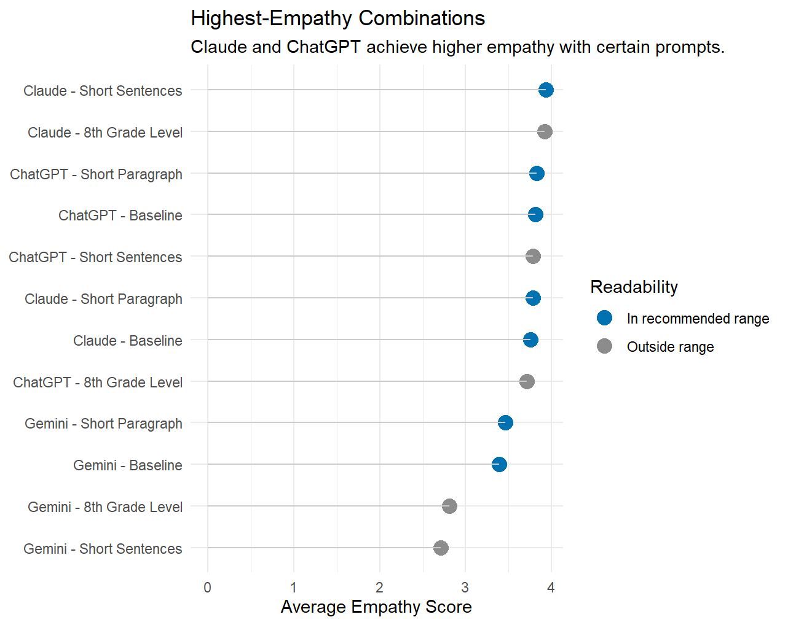
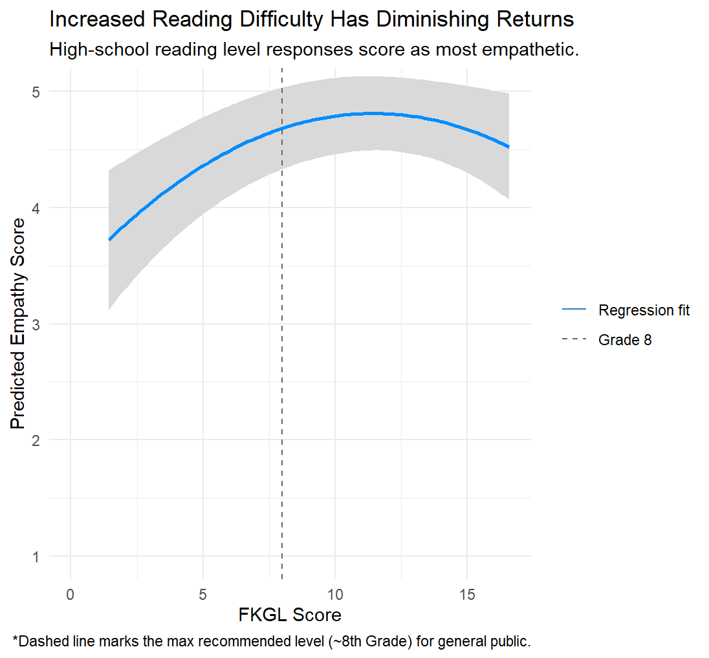
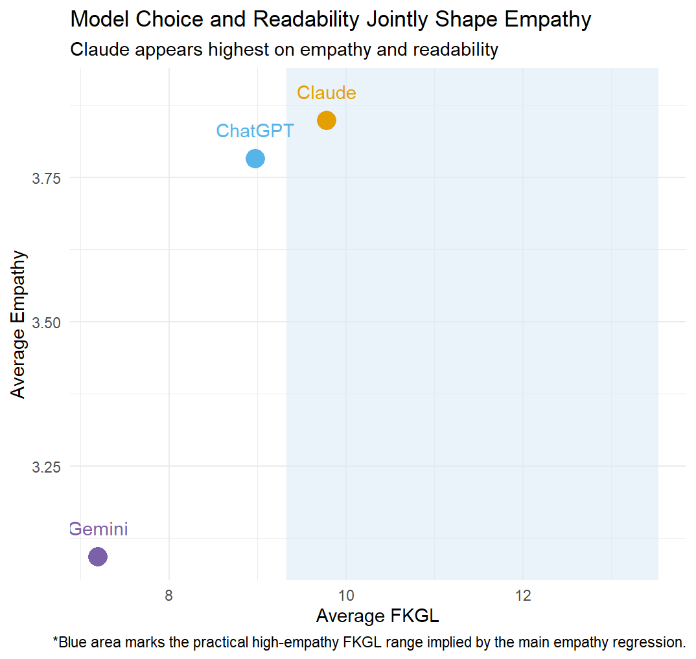

# ODI's chatbot challenge

## Better recommendations are not enough if the experience feels cold

ODI's chatbot has to solve a real customer experience problem, not just answer product questions.

::: medium-small
-   Riders ask nuanced pain, fit, and comfort questions before buying
-   Product information is technical and intimidating for beginners
-   Generic or overly dense answers can reduce confidence even when the recommendation is correct
-   Weak chatbot interactions risk lower conversion, weaker trust, and less repeat engagement
:::

. . .

**Business need:** Identify the chatbot configuration that feels clearest and most empathetic to customers.

# What this study set out to answer

## Which design choices improve perceived empathy?

This study tested whether ODI can improve chatbot service quality through:

::: medium-small
-   **model choice**
-   **prompt design**
-   **response readability**
:::

. . .

The goal was not simply to make responses shorter. The goal was to identify the response style that feels **clear, natural, and customer-first**.

# How the evaluation framework works

## A pre-launch testing system for chatbot quality

The framework turns chatbot design into a measurable business decision.

1.  **25 rider questions** provide realistic customer contexts.
2.  Multiple LLM and prompt configurations generate ODI responses.
3.  Each response is scored for readability.
4.  Two LLM judges rate perceived empathy using a SERVQUAL-based rubric.
5.  The results are analyzed to identify the strongest configuration.

. . .

This gives ODI a scalable way to test service quality before live deployment.

# What empathy means and why the scoring is reliable

## Empathy was evaluated as a structured service-quality construct

The scoring rubric measured whether the chatbot:

::: medium-small
-   addressed the rider's specific situation
-   used a caring and non-dismissive tone
-   prioritized comfort, fit, and safety over selling
-   correctly understood the rider's need
:::

. . .

Two LLM judges rated each response independently, with agreement checked using **quadratically weighted kappa**. This made the empathy score auditable and repeatable rather than subjective.

# What was measured and how it was analyzed

## The analysis separated structure from vocabulary

Two readability measures were tested:

::: medium-small
-   **Flesch-Kincaid Grade Level (FKGL):** structural complexity
-   **New Dale-Chall:** lexical difficulty
:::

. . .

The main regression tested whether readability predicted empathy while holding the rider question constant, with model and prompt included as controls.

# First business finding

## Model choice matters more than prompt tweaking

Across configurations, **model selection was the strongest driver of empathy**.

{fig-alt="Plot comparing the highest empathy scores across model and prompt combinations." width="78%"}

::: medium-small
-   Gemini responses showed an empathy penalty of roughly **0.6 to 0.7 points** on a 5-point scale relative to the reference model
-   GPT-4.1-mini did **not** significantly differ from the reference model
-   Prompt effects were directionally interesting but materially smaller than model effects
:::

. . .

**Implication:** ODI should treat model selection as the primary strategic lever.

# Second business finding

## Structural readability has a sweet spot

FKGL showed a **nonlinear** relationship with empathy.

{fig-alt="Regression plot showing the nonlinear relationship between readability and empathy." width="78%"}

::: medium-small
-   Very simple responses underperformed
-   Moderately sophisticated responses performed best
-   Excessively complex responses reduced perceived empathy
:::

. . .

The strongest responses landed around a **conversational high-school reading level**.

# Why the readability effect matters

## ODI should avoid both extremes

Responses that are too simple can sound robotic and generic. Responses that are too complex can sound technical, verbose, and emotionally distant.

. . .

The best-performing responses were:

::: medium-small
-   clear
-   specific
-   natural in tone
-   detailed enough to feel genuinely helpful
:::

. . .

Moving from very simple language to the optimal range improved empathy by roughly **0.3 to 0.5 points** on a 5-point scale.

# Third business finding

## Word difficulty is not a reliable optimization lever

Dale-Chall showed a weaker and less stable relationship with empathy.

::: medium-small
-   the pooled effect was small
-   the effect weakened under more conservative inference
-   direction and strength varied across models
:::

. . .

**Implication:** simplifying vocabulary alone is not enough to improve ODI's chatbot experience.

# Regression results at a glance

## Executive summary of the model outputs

{fig-alt="Scatterplot showing readability and empathy patterns by model." width="72%"}

| Driver | Result | What it means for ODI |
|----|----|----|
| Model choice | Largest effect | Biggest lever for service quality |
| FKGL | Strong, nonlinear | Target conversational high-school readability |
| Prompt design | Smaller effect | Best used for refinement |
| Dale-Chall | Weak, not robust | Not a dependable standalone lever |
| R-squared | \~0.79 to 0.80 | The models explain most empathy variation in this dataset |

# Why the results are credible

## The findings held after standard model checks

Validation included:

::: medium-small
-   nonlinear specification checks
-   multicollinearity checks
-   heteroskedasticity-robust inference
-   cluster-robust uncertainty by question
-   influence analysis for outliers
-   subgroup analysis by LLM
:::

. . .

The core conclusion stayed consistent: **readability matters, but model choice matters more**.

# What ODI should do next

## Recommended deployment priorities

::: medium-small
-   choose the best-performing model first
-   standardize response structure around a conversational high-school reading level
-   use customer-first framing for pain, fit, and comfort questions
-   treat prompt tuning as refinement, not rescue
-   validate live performance with real customer feedback after launch
:::

# Strategic takeaway

## ODI's opportunity is better service design, not just automation

The chatbot should be designed to:

::: medium-small
-   sound informed without sounding overly technical
-   acknowledge the rider's specific use case
-   balance clarity with enough detail to feel helpful and human
:::

. . .

The winning design is not the simplest response. It is the one that feels **clear, relevant, and empathetic**.

# Final recommendation

## Build the chatbot around trust

For ODI, the most effective chatbot strategy is to:

::: medium-small
-   select the highest-empathy model
-   optimize response structure, not only vocabulary
-   manage empathy as a measurable service KPI
-   use pre-launch evaluation to reduce deployment risk
:::

. . .

If ODI gets this right, the chatbot becomes a scalable brand touchpoint that improves confidence, conversion, and loyalty.

# References {.scrollable}

-   Friedman, D. B., and Hoffman-Goetz, L. (2006). A systematic review of readability and comprehension instruments used for print and web-based cancer information. *Health Education & Behavior*, *33*(3), 352-373.

-   Hsu, C., and Lin, J. C. (2023). Understanding the user satisfaction and loyalty of customer service chatbots. *Journal of Retailing and Consumer Services*, *71*, 103211. <https://doi.org/10.1016/j.jretconser.2022.103211>

-   Kull, A. J., Romero, M., and Monahan, L. (2021). How may I help you? Driving brand engagement through the warmth of an initial chatbot message. *Journal of Business Research*, *135*, 840-850. <https://doi.org/10.1016/j.jbusres.2021.03.005>

-   Kumar, A., Poungpeth, N., Yang, D., et al. (2026). When large language models are reliable for judging empathic communication. *Nature Machine Intelligence*, *8*, 173-185. <https://doi.org/10.1038/s42256-025-01169-6>

-   Parasuraman, A., Zeithaml, V. A., and Berry, L. L. (1988). SERVQUAL: A multiple-item scale for measuring consumer perceptions of service quality. *Journal of Retailing*, *64*(1), 12-40.

-   Singh, S., Jamal, A., and Qureshi, F. (2024). Readability metrics in patient education: Where do we innovate? *Clin Pract*, *14*(6), 2341-2349. <https://doi.org/10.3390/clinpract14060183>

-   Yun, J., and Park, J. (2022). The effects of chatbot service recovery with emotion words on customer satisfaction, repurchase intention, and positive word-of-mouth. *Frontiers in Psychology*, *13*, 922503. <https://doi.org/10.3389/fpsyg.2022.922503>
